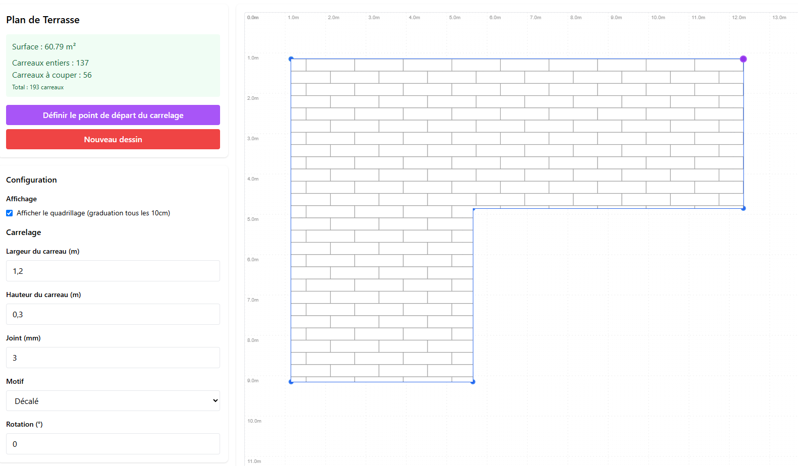

# Terrasse Planner

Terrasse Planner est une application web de calepinage de terrasse, pensée pour les particuliers et professionnels souhaitant planifier la pose de carrelage ou de dalles sur une terrasse de forme libre à angles droits.

---

## Fonctionnalités principales

- **Dessin interactif** : Définissez la forme de votre terrasse à la souris (polygone à angles droits).
- **Configuration du carrelage** :
  - Largeur, hauteur des carreaux (en cm)
  - Largeur des joints (en mm)
  - Type de pose : alignée ou décalée (quinconce)
  - Orientation (rotation en degrés)
  - Point de départ du calepinage (sélection d’un coin)
  - Option d’utilisation des chutes pour optimiser le nombre de carreaux
- **Visualisation en temps réel** :
  - Affichage du calepinage, des carreaux entiers, partiels, et des chutes réutilisées
  - Quadrillage métrique (graduation tous les 10 cm)
  - Affichage dynamique des dimensions et des distances
- **Calculs automatiques** :
  - Surface de la terrasse
  - Nombre de carreaux entiers, à couper, chutes utilisées, total, gain
  - Dimensions affichées sur le plan
- **Sauvegarde/chargement** :
  - Export et import du plan au format JSON

---

## Architecture technique

- **React** (front-end, logique d’UI et d’état)
- **Vite** (outillage et serveur de développement)
- **react-konva** (canvas interactif pour le dessin et le calepinage)
- **Tailwind CSS** (mise en forme rapide et responsive)

### Organisation du code

- `src/App.jsx` : composant principal, gestion des états globaux et orchestration
- `src/Sidebar.jsx` : panneau latéral (configuration, résumé, actions)
- `src/DrawingCanvas.jsx` : canvas interactif (dessin, calepinage, rendu)
- `src/useDrawing.jsx` : hook personnalisé pour la gestion du dessin et des points
- `src/useTiles.jsx` : hook personnalisé pour la logique de calepinage et le calcul des carreaux
- `src/index.jsx` : point d’entrée React
- `src/index.css` : styles globaux (via Tailwind)

---

## Prise en main rapide

```bash
# Clonez le dépôt
git clone <url-du-repo> # ou votre fork
cd terrasse-planner

# Installez les dépendances
npm install

# Lancez le serveur de développement
npm run dev
```

Ouvrez ensuite votre navigateur à l’adresse indiquée (souvent http://localhost:5173).

---

## Utilisation

1. **Démarrez un nouveau dessin** : cliquez sur "Nouveau dessin" puis placez les points de la terrasse (angles droits uniquement).
2. **Fermez la forme** : cliquez près du point de départ pour fermer la terrasse.
3. **Configurez le carrelage** :
   - Renseignez largeur, hauteur, joint, type de pose, rotation.
   - Cliquez sur "Définir le point de départ du calepinage" puis sélectionnez un coin.
4. **Visualisez le calepinage** :
   - Les carreaux s’affichent en temps réel, avec les dimensions et le nombre de carreaux calculés automatiquement.
5. **Sauvegardez ou chargez un plan** : utilisez les boutons dédiés pour exporter/importer votre configuration.

---

## Capture d’écran



---

## Contribution

Les contributions sont les bienvenues !
- Forkez le projet
- Créez une branche (`git checkout -b feature/ma-feature`)
- Commitez vos modifications
- Ouvrez une Pull Request

---

## Licence

MIT

---

Profitez d’une planification précise et intuitive pour vos projets de terrasse !


