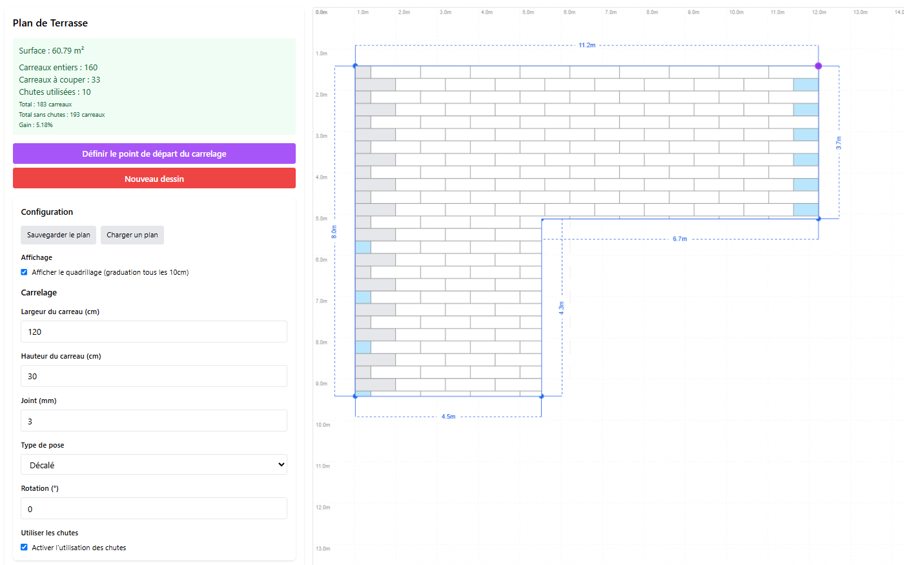

# Terrasse Planner

**Terrasse Planner** est une application web intuitive pour dessiner la forme de votre terrasse, calculer sa surface, et simuler la pose de carrelage selon vos paramètres (dimensions, joints, orientation, type de pose, etc.).

---

## ✨ Fonctionnalités principales

- **Dessin interactif** : Tracez la forme de votre terrasse (polygone à angles droits) à la souris.
- **Échelle personnalisable** : Ajustez l'échelle (pixels/mètre) pour des dimensions réelles.
- **Simulation de carrelage** :
  - Choisissez la taille des carreaux, l'espacement des joints, l'orientation et le type de pose (aligné ou décalé).
  - Définissez le point de départ du calepinage.
  - Visualisez le calepinage en temps réel.
- **Calcul automatique** :
  - Surface de la terrasse
  - Nombre de carreaux entiers et à couper
  - Dimensions affichées sur le plan
- **Quadrillage** : Affichage optionnel d'un quadrillage métrique (graduation tous les 10 cm).

---

## 🚀 Installation rapide

```bash
# Clonez le dépôt
git clone https://github.com/ClementV78/terrasse-planner.git
cd terrasse-planner

# Installez les dépendances
npm install

# Lancez le serveur de développement
npm run dev
```

Ouvrez ensuite votre navigateur à l'adresse [http://localhost:3000](http://localhost:3000).

---

## 🖱️ Guide d'utilisation

1. **Nouveau dessin** : Cliquez sur "Nouveau dessin" puis placez les points de la terrasse (angles droits uniquement).
2. **Fermer la forme** : Cliquez près du point de départ pour fermer la terrasse.
3. **Configurer le carrelage** :
   - Renseignez largeur, hauteur, joint, type de pose, rotation.
   - Cliquez sur "Définir le point de départ du calepinage" puis sélectionnez un coin.
4. **Visualisation** :
   - Le calepinage s'affiche automatiquement.
   - Les dimensions et le nombre de carreaux sont indiqués.

---

## 🛠️ Technologies
- [React](https://react.dev/)
- [Vite](https://vitejs.dev/)
- [react-konva](https://konvajs.org/docs/react/index.html) (canvas interactif)
- [Tailwind CSS](https://tailwindcss.com/)

---

## 📸 Capture d'écran

> 

---

## 🤝 Contribuer

Les contributions sont les bienvenues !
- Forkez le projet
- Créez une branche (`git checkout -b feature/ma-feature`)
- Commitez vos modifications
- Ouvrez une Pull Request

---

## 📄 Licence

Ce projet est sous licence MIT.

---

## 👤 Auteur

- [ClementV78](https://github.com/ClementV78)

---

Profitez d’une planification précise et intuitive pour vos projets de terrasse !


